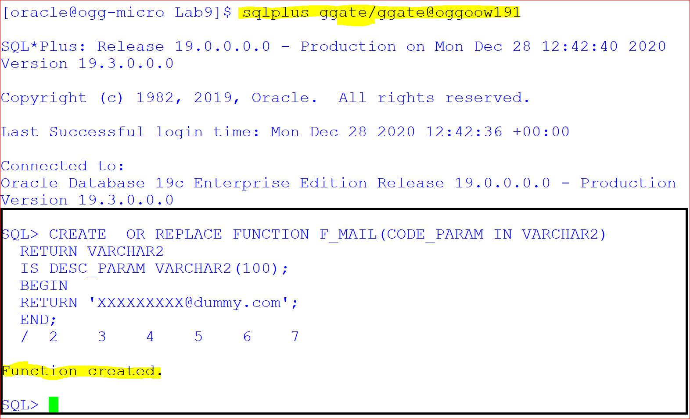

# GoldenGate Microservices Transformations 

## Introduction

This lab is intended to give you familiarity with how to configure GG for database to database replication transformations. GoldenGate is Non-invasive, real-time transactional data streaming
Secured, reliable and fault-tolerant data delivery. It is easy to install, configure and maintain real-time changed data
Easily extensible and flexible to stream transformed data to other relational targets

### Lab Architecture


Lab  – Create GoldenGate Microservices Replication

Lab  – Active - Active Replication

Lab  – High Availability / Disaster Recovery

Lab  - Transformations using GoldenGate Microservices

*Estimated Lab Time*:  60 minutes

### Objectives

To use GoldegGate to perform transformations on the data during the replication process. Even though GoldenGate is primarily a real time data replication tool, it does have the ability to create data transformations. In this lab we will create sample transformations to showcase this feature of GoldenGate.


### Prerequisites
This lab assumes you have:
- A Free Tier, Paid or LiveLabs Oracle Cloud account
- SSH Private Key to access the host via SSH
- You have completed:
    - Lab: Generate SSH Keys
    - Lab: Prepare Setup
    - Lab: Environment Setup
    - Lab: Configure GoldenGate

In this lab we will setup GoldenGate Microservices Transformations

## **STEP 1:** Preparation for Data Transformations

Open a terminal session and switch to ***oracle*** user

````
<copy>sudo su - oracle</copy>
````


1.	Add a new column ***CUSTOMER_NAME*** to target table ***CUSTOMERS***

login to target schema GGATE of pdb ***OGGOOW191*** and add new column CUSTOMER_NAME to table ***CUSTOMERS***

```
<copy>
sqlplus ggate/ggate@oggoow191
</copy>
```
 
```
<copy>
ALTER TABLE SOE.CUSTOMERS  ADD (CUSTOMER_NAME VARCHAR2(40));
</copy>
```


2.	Create Table LOGON_AUDIT for testing the OGG environmental variables and tokens 

```
<copy>CREATE TABLE "SOE"."LOGON_AUDIT" 
       (     "LOGON_ID" NUMBER , 
             "CUSTOMER_ID" NUMBER, 
             "LOGON_DATE" DATE, 
             "HOST" VARCHAR2(40), 
             "GG_GROUP" VARCHAR2(40), 
             "OSUSER" VARCHAR2(40), 
             "DOMAIN" VARCHAR2(40), 
             "BA_IND" VARCHAR2(40), 
             "COMMIT" VARCHAR2(40), 
             "POS" VARCHAR2(40), 
             "RBA" VARCHAR2(40), 
             "TABLENAME" VARCHAR2(40), 
             "OPTYPE" VARCHAR2(40) 
       ) ;
</copy>
```


## **STEP 2:** Concatenating the source ‘m‘ columns into target single ‘n’ columns


1.	Go to Admin Server console for deployment Boston (https://XX.XX.XX.XX:17001)/ https://XX.XX.XX.XX/services/Boston/adminsrvr/v2/content/index.html  and edit the parameter of the REPLICAT IREP with the attributes to pass customer email to SQLEXEC() for execution of stored procedure and mapping  to the target table. Delete all the mapping or comment the existing the mapping using '-'. 


```
<copy>MAP OGGOOW19.SOE.CUSTOMERS, TARGET oggoow191.SOE.CUSTOMERS, KEYCOLS(customer_id), &
         COLMAP (USEDEFAULTS,CUSTOMER_NAME =@STRCAT(CUST_FIRST_NAME,' ',CUST_LAST_NAME));
</copy>

```


2.	Open the Administration Server of the Target deployment i.e. Boston at (https://XX.XX.XX.XX:17001)/ https://XX.XX.XX.XX/services/Boston/adminsrvr/v2/content/index.html . When the page is completely open, you should be at a page where you can see Replicat IREP. Please stop and start the IREP process.

Stop  :


Start : 


3. Open a terminal window,login to source PDB and  ***insert data*** into customer table.


```
<copy>sqlplus ggate/ggate@oggoow19
</copy>
```

```
 <copy>
 INSERT INTO SOE.CUSTOMERS VALUES (12345678,'LARRY','ELLISON','NY','NEW YORK','5000','LARRY@ORACLE.COM','365','15-OCT- 11','BUSINESS','MUSIC','4-JAN-61','Y','N','2767122','126219999');
 
 commit;
 
 </copy>
```
**1 row created**

output:


5. After the insert transaction on the source table, query target table **CUSTOMER** on PDB OGGOOW191

```
<copy>sqlplus ggate/ggate@oggoow191

</copy>
```

```
<copy>select CUST_FIRST_NAME,CUST_LAST_NAME,CUSTOMER_NAME from SOE.CUSTOMERS where customer_id=12345678;
exit;

</copy>
```


output:


## **STEP 3:** Masking the Source Crucial email-id’s into a dummy email in the target


1. Go to Admin Server console for deployment Boston `(https://XX.XX.XX.XX:17001) / https://XX.XX.XX.XX/services/Boston/adminsrvr/v2/content/index.html ` and edit the parameter of the REPLICAT IREP with the attributes to pass customer email to SQLEXEC() for execution of stored procedure and mapping to the target table.Delete all the mapping or comment the existing the mapping using '-". 

**Replicat Definition**

2. edit the REPLICAT **IREP** and add the following lines

```
<copy>
MAP oggoow19.SOE.CUSTOMERS, TARGET oggoow191.SOE.CUSTOMERS, keycols(customer_id), &
SQLEXEC (SPNAME P_MAIL, PARAMS (code_param = CUST_EMAIL)), &
COLMAP (USEDEFAULTS, CUST_EMAIL = P_MAIL.desc_param,CUSTOMER_NAME =@STRCAT(CUST_FIRST_NAME,CUST_LAST_NAME));
</copy>
```


3. Open Terminal and SQLPLUS into Target Database (OGGOOW191).Create a required stored procedure under GGATE users. This will be used in the SQLEXEC call in the mapping statement

```
<copy>sqlplus ggate/ggate@oggoow191

</copy>
```

```
<copy>CREATE  OR REPLACE FUNCTION F_MAIL(CODE_PARAM IN VARCHAR2) 
  RETURN VARCHAR2 
  IS DESC_PARAM VARCHAR2(100);
  BEGIN 
  RETURN 'XXXXXXXXX@dummy.com'; 
  END;
  /

  </copy>
```

**Press Enter**

**Function created**



```

<copy>CREATE OR REPLACE PROCEDURE  P_MAIL (CODE_PARAM IN VARCHAR2,DESC_PARAM  OUT VARCHAR2)
  IS 
  begin
  select F_MAIL('CODE_PARAM')
      into DESC_PARAM
      from dual;
  end;
  /
  
  </copy> 

  ```

**Press Enter**

**Procedure created**


4. Validate the function by passing any name as **Arguement**

```
<copy>select F_MAIL('MADHU') from dual;

exit;

</copy>
```

output:


5. Open the Administration Server of the Target deployment i.e. Boston at(https://XX.XX.XX.XX:17001)/ https://XX.XX.XX.XX/services/Boston/adminsrvr/v2/content/index.html . When the page is completely open, you should be at a page where you can see Replicat IREP. Please stop and start the IREP process.
   
 Stop  :


Start : 


6. Open the Terminal and SQLPLUS into Source PDB (OGGOOW19) and do the update transcation on the table CUSTOMER by executing below update statements 


```
<copy>sqlplus ggate/ggate@oggoow19

</copy>
```

```
<copy>

update soe.customers  set CUST_EMAIL='alberto.may@hotmail.com' where CUSTOMER_ID=562;
update soe.customers  set CUST_EMAIL='andrew.king@virgin.com' where CUSTOMER_ID=563;
update soe.customers  set CUST_EMAIL='francisco.simpson@msn.com' where CUSTOMER_ID=564;
update soe.customers  set CUST_EMAIL='kenneth.martin@aol.com' where CUSTOMER_ID=565;
update soe.customers  set CUST_EMAIL='steven.jackson@virgin.com' where CUSTOMER_ID=566;
update soe.customers  set CUST_EMAIL='terry.nguyen@googlemail.com' where CUSTOMER_ID=567;
update soe.customers  set CUST_EMAIL='dewey.duran@ntlworld.com' where CUSTOMER_ID=568;
update soe.customers  set CUST_EMAIL='leroy.snyder@msn.com' where CUSTOMER_ID=569;
update soe.customers  set CUST_EMAIL='tracy.guerrero@yahoo.com' where CUSTOMER_ID=570;

commit;

exit;


</copy>
```
7.	Check the Target tables, is stored procedure was executed for static masking of the emails. Open Terminal and SQLPLUS into Target PDB (OGGOOW191). Excute “select CUSTOMER EMAIL from soe.customers where customer_ID between 562 and 570;” in SQLPLUS

```
<copy>sqlplus ggate/ggate@oggoow191

</copy>
```
```
<copy>select CUST_EMAIL from soe.customers where customer_ID between 562 and 570;

exit;

</copy>
```

output: 
 


## **STEP 4:** Using Environment Variables/Tokens

   


1.	Go to Admin Server console for deployment Baston (https://XX.XX.XX.XX:17001)/ https://XX.XX.XX.XX/services/Boston/adminsrvr/v2/content/index.html  and edit the parameter of the REPLICAT IREP with the attributes to map the Environment Variables to the audit table. Add the following after *useridalias command

2. edit Relicat Settings REPLICAT IREP and add the following lines
   
```
<copy>
MAP oggoow19.SOE.LOGON, TARGET oggoow191.SOE.LOGON_AUDIT, KEYCOLS(LOGON_ID), &
COLMAP (USEDEFAULTS,&
host=@GETENV('GGENVIRONMENT','HOSTNAME'),&
gg_group=@GETENV ('GGENVIRONMENT','GROUPNAME'),&
osuser=@GETENV ('GGENVIRONMENT','OSUSERNAME'),&
domain=@GETENV ('GGENVIRONMENT','DOMAINNAME'),&
ba_ind=@GETENV ('GGHEADER','BEFOREAFTERINDICATOR'),&
commit=@GETENV ('GGHEADER','COMMITTIMESTAMP'),&
pos=@GETENV ('GGHEADER','LOGPOSITION'),&
rba=@GETENV ('GGHEADER','LOGRBA'),&
tablename=@GETENV ('GGHEADER','TABLENAME'),&
optype=@GETENV ('GGHEADER','OPTYPE'));
</copy>
 ```

 
3. REPLICAT IREP param file will look like
   


4. Open the Administration Server of the Target deployment i.e. Boston at (https://XX.XX.XX.XX:17001)/ https://XX.XX.XX.XX/services/Boston/adminsrvr/v2/content/index.html . When the page is completely open, you should be at a page where you can see **Replicat IREP**.  Please stop and start the IREP process

 Stop  :


Start : 


5. Open the terminal and log into SQLPLUS to do transaction on source DB (OGGOOW19) in table LOGON

```
<copy>sqlplus ggate/ggate@oggoow19

</copy>
```


```
<copy>
insert into soe.logon values ('48092713',130159,sysdate);
insert into soe.logon values ('48092714',130160,sysdate);
insert into soe.logon values ('48092715',130161,sysdate);
commit;
exit;


 </copy>
```

**3 rows created**

output:


6. Open the terminal and log into SQLPLUS to do look at the transactions replicated on target DB (OGGOOW191) in table *LOGON_AUDIT


```
<copy>sqlplus ggate/ggate@oggoow191

</copy>
```
```
<copy>
col DOMAIN for a7
col BA_IND for a10
col COMMIT for a10
col GG_GROUP for a10
col POS   for a10
col TABLENAME for a20
col OPTYPE for a8
col RBA  for a10
col HOST for a10
col GG_GROUP for a5
col OSUSER for a10
col DOMAIN for a10
set pages 333 lines 333
show con_name
show user
select * from SOE.LOGON_AUDIT;
exit;


</copy>
```

output:


### Summary

Oracle GoldenGate offers high-performance, fault-tolerant, easy-to-use, and flexible real- time data streaming platform. It easily extends customers’ real-time data
integration architectures without impacting the performance of the source systems and enables timely business insight for better decision making.

You may now *proceed to the next lab*.

## Learn More

* [GoldenGate Microservices](https://docs.oracle.com/en/middleware/goldengate/core/19.1/understanding/getting-started-oracle-goldengate.html#GUID-F317FD3B-5078-47BA-A4EC-8A138C36BD59)

## Acknowledgements
* **Author** - Madhu Kumar S ,Brian Elliott Data Integration, January 2021
* **Contributors** - Madhu Kumar S  
* **Last Updated By/Date** - Madhu Kumar S January 2021

## Need Help?
Please submit feedback or ask for help using our [LiveLabs Support Forum](https://community.oracle.com/tech/developers/categories/goldengate-on-premises). Please click the **Log In** button and login using your Oracle Account. Click the **Ask A Question** button to the left to start a *New Discussion* or *Ask a Question*.  Please include your workshop name and lab name.  You can also include screenshots and attach files.  Engage directly with the author of the workshop.

If you do not have an Oracle Account, click [here](https://profile.oracle.com/myprofile/account/create-account.jspx) to create one.